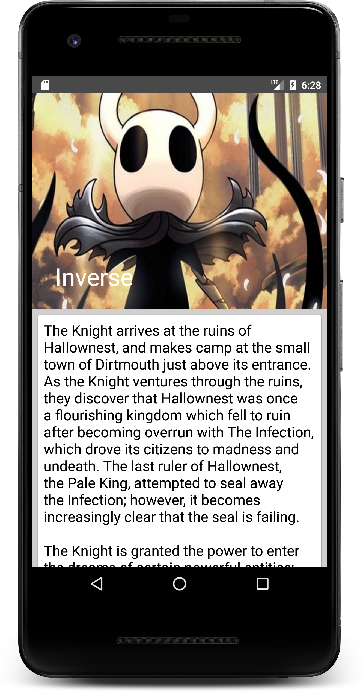
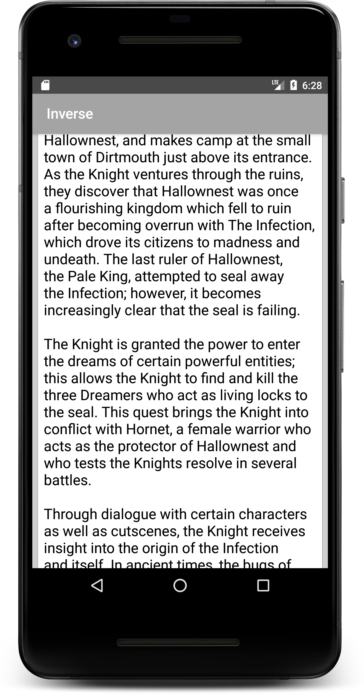
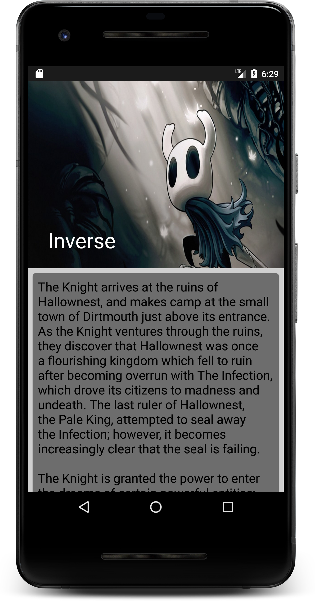
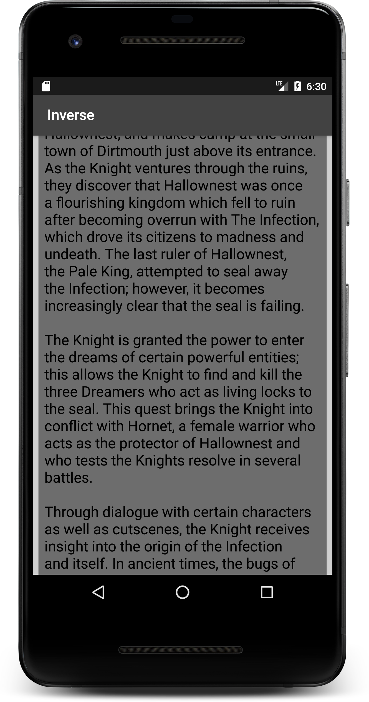

# Inverse - messing around with DayNightMode and some styling

Just a basic proof of concept for making use of AppCompatDelegate to manipulate the app, a collapsing toolbar layout and some basic styling

# Summary
Made this project just as a basic example for how you'd use AppCompatDelegate.setDefaultNightMode and for using a collapsing toolbar layout, for easy reference in future 

# How it's done
The app makes use of Kotlin and a few other libraries to create a native android application 

- Coroutines - For performing tasks on different threads (here they were just used to simulate retrieving data from an API/Database)
- Koin - For easier management of dependencies
- MaterialComponents - For the UI
- CollapsingToolbarLayout - for a cool UX

...and a few more

# How would you run this ? 

You can simply clone this from github and open the project using android studio (the `master` branch is usually where the latest stable build can be found, `dev` is where I work on new features)  there shouldn't be any additional requirements or configurations needed.

# Attribution
[The Hollow Knight Wikipedia page](https://en.wikipedia.org/wiki/Hollow_Knight) for the text  
[https://www.hollowknight.com/](https://www.hollowknight.com/) thanks for creating a truly amazing experience

